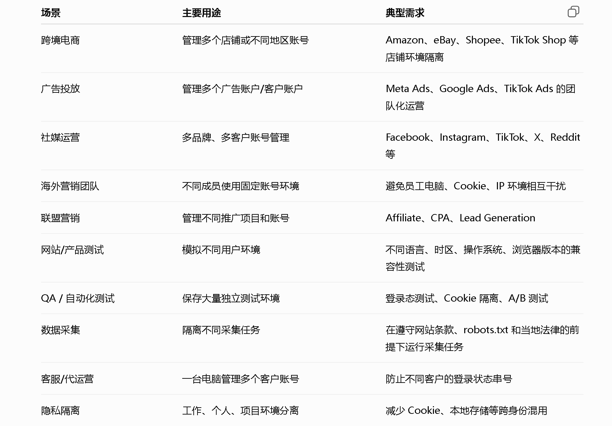
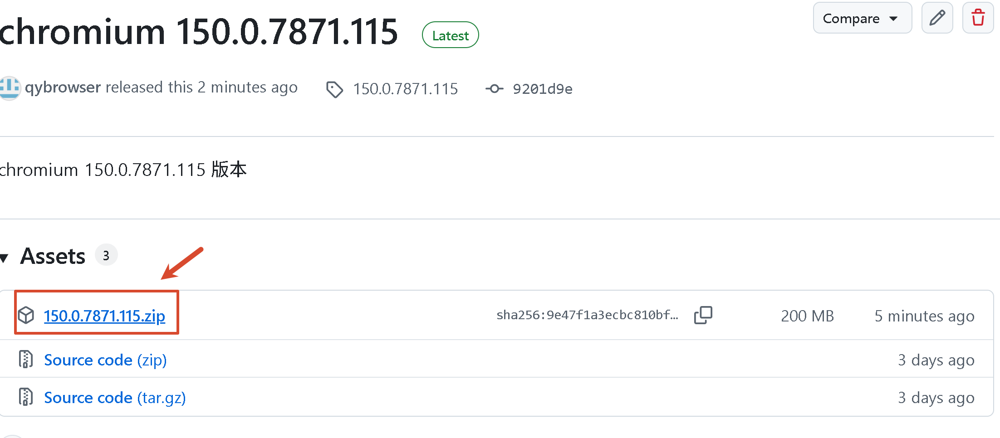
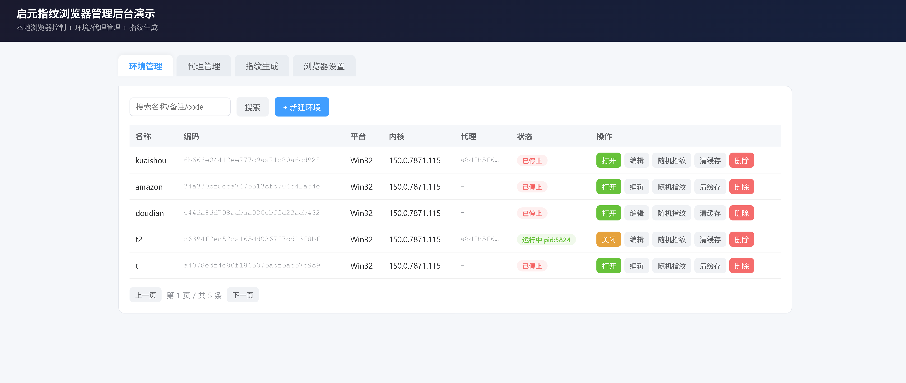
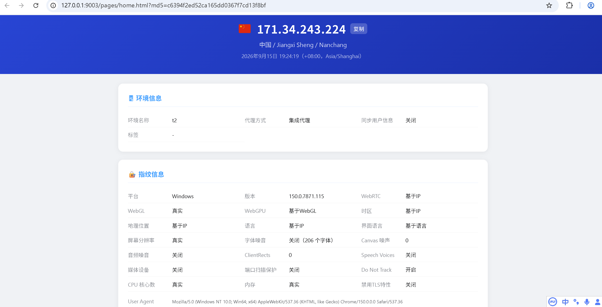

# 启元指纹浏览器（Qiyuan Fingerprint Browser）

启元指纹浏览器是一款基于 Chromium 和 Python 的开源指纹浏览器，支持创建相互隔离的浏览器环境，并为不同环境配置独立的浏览器指纹与网络代理。项目在本地运行，提供可视化管理后台，适合多账号管理、跨境电商、广告投放、自动化测试和浏览器指纹研究等场景。

> 请在遵守目标网站服务条款及所在地法律法规的前提下使用本项目。

[项目介绍](#一项目介绍) · [检测结果](#二浏览器指纹检测结果) · [快速开始](#三快速开始) · [商用推荐](#四商用指纹浏览器推荐) · [联系作者](#五联系与讨论)

## 一、项目介绍

浏览器指纹由 User-Agent、操作系统、屏幕参数、字体、Canvas、WebGL、时区、语言等信息共同构成。网站可以组合这些信息来识别浏览器环境。指纹浏览器通过为每个环境提供相对独立且一致的配置，减少多个账号之间因 Cookie、本地存储和设备信息混用而产生的关联。

启元指纹浏览器目前提供：

- 独立浏览器环境与本地数据隔离
- 浏览器指纹生成与环境配置
- HTTP、HTTPS、SOCKS5 代理管理
- 可视化环境管理后台
- 基于 Python 的本地 SDK 和 HTTP API
- 本地 SQLite 数据存储

典型应用场景包括跨境电商、广告投放、社交媒体运营、海外团队协作、联盟营销、网站兼容性测试、QA 自动化测试、合规数据采集以及不同工作身份的隐私隔离。



## 二、浏览器指纹检测结果

以下为 **2026-09-15** 的测试记录：

| 检测平台 | 检测结果 |
| --- | :---: |
| [BrowserScan](https://browserscan.net/) | ✅ 通过 |
| [Sannysoft Bot Test](https://bot.sannysoft.com/) | ✅ 通过 |
| [CreepJS](https://abrahamjuliot.github.io/creepjs/) | ✅ 通过 |
| [FV.PRO Privacy Check](https://fv.pro/check-privacy/general) | ✅ 通过 |
| [Fingerprint.com Demo](https://fingerprint.com/demo/) | ✅ 通过 |
| [PixelScan](https://pixelscan.net/fingerprint-check) | ⚠️ 待优化 |
| [IPHey](https://iphey.com/) | ⚠️ 待优化 |

> 检测结果会受到浏览器版本、操作系统、网络代理、指纹配置以及检测网站规则更新的影响，仅代表测试时的结果，不构成持续通过保证。

## 三、快速开始

当前项目适用于 Windows。请先安装 Git 和 Python，再按以下步骤安装启元指纹浏览器。

### 1. 下载项目源码

```bash
git clone https://github.com/qybrowser/qiyuanbrowser.git
cd qiyuanbrowser
```

### 2. 下载 Chromium 浏览器内核

打开项目的 [GitHub Releases](https://github.com/qybrowser/qiyuanbrowser/releases)，进入最新版本，在 **Assets** 中下载以版本号命名的浏览器内核压缩包，例如 `150.0.7871.115.zip`。不要下载 GitHub 自动生成的 `Source code (zip)` 或 `Source code (tar.gz)`，它们不包含可运行的浏览器内核。



下载完成后，将内核解压到源码的 `qiyuan/client/` 目录。版本号必须作为内核的直接目录，结构如下：

```text
qiyuanbrowser/
└── qiyuan/
    └── client/
        └── 150.0.7871.115/
            ├── QyBrowser.exe
            ├── chrome.dll
            ├── 150.0.7871.115.manifest
            └── ...
```

> **重要：**目录层级必须与上面保持一致，即 `qiyuan/client/<内核版本>/QyBrowser.exe`。不要多套一层同名目录，也不要把内核文件直接放在 `client` 下，否则程序将无法找到浏览器内核。

### 3. 安装 Python 依赖

在项目根目录执行：

```bash
pip install -r requirements.txt
```

### 4. 启动管理后台

```bash
python -m admin.server
```

服务启动后，在浏览器中访问：

```text
http://127.0.0.1:9003
```

进入管理后台后，即可创建浏览器环境、配置代理与指纹并启动环境。首次启动会将仓库内的浏览器文件初始化到 `%USERPROFILE%/.qiyuan`，所需时间可能比后续启动稍长。

### 实际运行效果

启动服务后，可以在启元指纹浏览器管理后台统一管理浏览器环境、代理和指纹配置：



打开浏览器环境后，启动页会显示当前 IP、地理位置、代理方式以及 WebRTC、WebGL、时区、语言、Canvas 等浏览器指纹信息：



## 四、商用指纹浏览器推荐

本项目适合本地部署、指纹浏览器研究和 Python 二次开发。如果需要成熟的团队协作、账号权限管理、跨平台客户端、云端同步或商业售后服务，可以参考下面的商用指纹浏览器进行选型。

### 国内商用指纹浏览器

| 产品 | 主要特点 | 适用场景 |
| --- | --- | --- |
| [AdsPower](https://www.adspower.com/)（[国内站](https://adspower.net/)） | 中文界面，提供 API、RPA 自动化、窗口同步和多平台客户端 | TikTok Shop、Amazon、社媒矩阵及需要 Python 自动化对接的团队 |
| [比特浏览器 BitBrowser](https://www.bitbrowser.cn/) | Chrome 与 Firefox 双内核、本地 API、团队权限管理 | 中小团队、个人用户及需要双内核测试的场景 |
| [候鸟浏览器 MBBrowser](https://www.mbbrowser.com/) | 支持本地离线模式，可对接 Selenium、Puppeteer，并支持环境批量导入导出 | 重视本地数据存储的开发者和自动化脚本用户 |
| [紫鸟浏览器](https://www.ziniao.com/) | 面向跨境电商团队，提供店铺管理、团队权限及运营相关能力 | Amazon 等跨境电商平台和较大型运营团队 |

### 海外商用指纹浏览器

| 产品 | 主要特点 | 适用场景 |
| --- | --- | --- |
| [Multilogin](https://multilogin.com/) | 面向企业用户，提供多浏览器内核、API 和较完整的指纹参数管理 | 高风控业务及企业级账号矩阵运营 |
| [GoLogin](https://gologin.com/) | 提供云端浏览器模式、Linux 支持和代理相关服务 | 海外社媒、联盟营销和云端无人值守场景 |
| [Dolphin Anty](https://dolphin-anty.com/) | 提供自动化场景构建和批量环境管理能力 | 广告投放、联盟营销、个人用户及小型工作室 |
| [EchoX](https://echoxbrowser.com/)（[GitHub](https://github.com/EchoXBrowser/EchoX)） | 偏重 API、RPA 和二次开发，支持 Windows、macOS 与 Linux | 自研自动化系统及需要深度集成的开发团队 |

选择指纹浏览器时，建议重点比较浏览器内核、指纹一致性、代理支持、API 与自动化能力、团队权限、数据存储方式、操作系统支持和售后服务，而不应只比较可创建的环境数量。

> 上述商用指纹浏览器推荐仅作为选型参考，不代表本项目与相关产品存在合作或背书关系。产品功能、价格、免费额度和平台支持可能发生变化，请以官方网站的最新信息为准。

## 五、联系与讨论

如果在安装、启动或使用过程中遇到问题，欢迎通过 [GitHub Issues](https://github.com/qybrowser/qiyuanbrowser/issues) 反馈。提交问题时建议附上 Windows 版本、Python 版本、错误日志和复现步骤，以便更快定位问题。

也可以扫描下方二维码联系作者：


二维码无法显示时，可直接访问：[联系作者](https://res.usefullc.com/fingerprint/qiyuan_kefu.jpg)。

---

<details>
<summary><strong>开发者文档：SDK、HTTP API 与配置参考</strong></summary>

<br>

## Chromium Fingerprint SDK (Python)

A self-contained Python SDK for managing fingerprint-browser environments. It
unifies two surfaces into **one module**:

- **Environment / proxy management** — a simplified reimplementation of the
  cloud backend (`backend/app/api/v1/browser.py`, `proxy.py`, `fingerprint.py`),
  persisted to a local **SQLite** database.
- **Local browser control** — launches the qiyuan client browser in
  `--mode=client` (uuid + token only); the browser pulls and decrypts its own
  fingerprint from the SDK via `GET /api/v1/browser/md5/{uuid}`.
- **Client callbacks** — the 6 endpoints the launched browser calls back into
  (fingerprint, error report, tabs, status, ip-geo, check-proxy), faithfully
  ported from `backend/` and `front-electron/src/main/http-server.ts`.

No cloud backend and no Electron client are required to run it.

## How launching works

`env_open` runs the qiyuan kernel like:

```
%USERPROFILE%\.qiyuan\client\{browser_version}\QyBrowser.exe
  --mode=client --uuid={code} --token={token}
  --user-data-dir=%USERPROFILE%\.qiyuan\user_data\{code}
  --browser_app_data_dir=%USERPROFILE%\.qiyuan
  --enable-logging=stderr --log-level=0 --v=1
  --proxy-bypass-list="localhost;127.0.0.1;<local>"
  --no-first-run --new-window --window-position=0,0 --window-size=1280,720
```

No `--user-agent` / `--proxy-server` / `--remote-debugging-port` — those live
inside the encrypted fingerprint the browser fetches itself. Before launching,
the SDK writes the admin server URL into `%USERPROFILE%\.qiyuan\config\config.json`
(`base_api_path`) so the browser calls back into this SDK. Older kernel folders
may still contain `chrome.exe`; the launcher prefers `QyBrowser.exe` and falls
back to `chrome.exe`.

## Install and prepare the browser

On first admin-server start, the `client`, `config`, and `extends` directories
from this repository's `qiyuan/` directory are copied to `%USERPROFILE%/.qiyuan` without
overwriting existing files. If you choose a custom browser application directory
in the admin UI, copy these three directories there manually. The packaged
directories are:

- `client` — browser kernels and their runtime files.
- `config` — browser configuration and public key.
- `extends` — built-in browser extensions.

For a custom location, open the admin UI's **浏览器设置** tab and set
`browser_app_data_dir` to the copied `qiyuan` root.

```bash
pip install -r requirements.txt   # only needed for the admin web UI
```

Install the listed dependencies for encryption, geo/proxy checks, and the admin UI.

## SDK usage

```python
from chromium_sdk import ChromiumClient

client = ChromiumClient()                       # data in ~/.qiyuan

code = client.env_create(name="env-1", platform="Win32")["code"]
client.env_open(code)                           # launches real Chrome
print(client.env_status(code))                  # {'status': 'running', ...}
client.env_close(code)
```

## The 14 operations

| Group | Method | HTTP route (admin) |
|-------|--------|--------------------|
| Env | `env_list` | `GET /open/env/list` |
| Env | `env_create` | `POST /open/env/create` |
| Env | `env_update` | `POST /open/env/update` |
| Env | `env_delete` | `POST /open/env/delete` |
| Env | `env_open` | `POST /open/env/open` |
| Env | `env_close` | `POST /open/env/close` |
| Env | `env_status` | `GET /open/env/status` |
| Env | `env_clear_cache` | `POST /open/env/clear_cache` |
| Env | `env_randomize_fingerprint` | `POST /open/env/randomize_fingerprint` |
| Proxy | `proxy_list` | `GET /open/proxy/list` |
| Proxy | `proxy_create` | `POST /open/proxy/create` |
| Proxy | `proxy_update` | `POST /open/proxy/update` |
| Proxy | `proxy_delete` | `POST /open/proxy/delete` |
| Fingerprint | `generate_fingerprint` | `POST /open/fingerprint/generate` |

### Client callback endpoints (called by the launched browser)

| Method | Auth | Route |
|--------|------|-------|
| `get_encrypted_fingerprint` | Bearer | `GET /api/v1/browser/md5/{uuid}` |
| `report_error` | — | `POST /api/v1/browser/error/report` |
| `update_tabs` | — | `POST /api/v1/client/browser/tabs` |
| `check_proxy` | — | `POST /api/check-proxy` |
| `ip_geo` | Bearer | `GET /api/ip-geo` |
| `record_status` | — | `POST /api/browser/status` |

Fingerprint encryption (`GET /api/v1/browser/md5/{uuid}?secure=&encrypt_type=&version=`):

- `secure=false` → plaintext JSON (`encrypt_type` ignored).
- `encrypt_type=aes` (default) → `base64(IV[16] + AES-256-CBC(PKCS7(json)))`.
  - `version=1.0` (default) key: `aes-key-32-bytes-change!!!!!` padded to 32 bytes.
  - `version=2.0` key: `SHA-256("aes-key-32-bytes-change!!!!!" + "_qiyuan_" + token)`
    (32 bytes, per-user; token = the Bearer auth token).
- `encrypt_type=rsa` → AES 加密 + RSA 签名: `base64(SIGN[keysize/8] + IV[16] +
  AES-256-CBC(PKCS7(json)))`. AES key 恒由 token 派生（同 v2.0）；`SIGN =
  RSASSA-PKCS1-v1_5(私钥, SHA-256(IV+密文))`。服务端持**私钥签名**，内核只内置
  **公钥验签**后用 token 派生 key 解密——私钥永不下发。Keys in `chromium_sdk/keys/`
  (override via `CHROMIUM_SDK_RSA_PRIVATE_KEY`；公钥下发给内核). SDK 与 backend
  使用各自独立的密钥对。

Full HTTP reference: `backend/app/templates/chromium_api.html`.

## Management admin

```bash
cd qiyuanbrowser
uvicorn admin.server:app --host 127.0.0.1 --port 9003
# or: python -m admin.server
```

Open <http://127.0.0.1:9003> — a single-page UI to manage environments, proxies
and preview generated fingerprints. The admin and the SDK share the same SQLite
store.

## Configuration

| Env var | Purpose                                                         |
|---------|-----------------------------------------------------------------|
| `CHROMIUM_SDK_DATA_DIR` | SDK data dir (SQLite). Default `~/.qiyuan`                      |
| `CHROMIUM_SDK_TOKEN` | Static token; default auto-generated and stored in SQLite       |
| `CHROMIUM_SDK_BASE_API` | URL written into config.json. Default `http://127.0.0.1:9003`   |
| `CHROMIUM_SDK_QIYUAN_DIR` | Complete qiyuan root; overridden by a value saved in the admin UI |

Data layout:

```
$CHROMIUM_SDK_DATA_DIR/db/qiyuan.db           # SQLite (environments, proxies, errors, config)
$CHROMIUM_SDK_DATA_DIR/logs/qiyuan.log        # 服务日志；控制台同步输出，保留最近 7 天
%USERPROFILE%/.qiyuan/client/{version}/QyBrowser.exe  # kernel (fallback: chrome.exe)
%USERPROFILE%/.qiyuan/user_data/{uuid}/                # per-environment user-data-dir
%USERPROFILE%/.qiyuan/config/config.json               # base_api_path -> admin server
%USERPROFILE%/.qiyuan/extends/                          # built-in browser extensions
```

启动时若发现旧版 `$CHROMIUM_SDK_DATA_DIR/chromium_sdk.db` 且新库尚不存在，会将数据迁移到 `db/qiyuan.db`；旧库保留不删除。服务日志按天轮转，当前文件加最近 6 个归档文件共保留 7 天。

</details>
